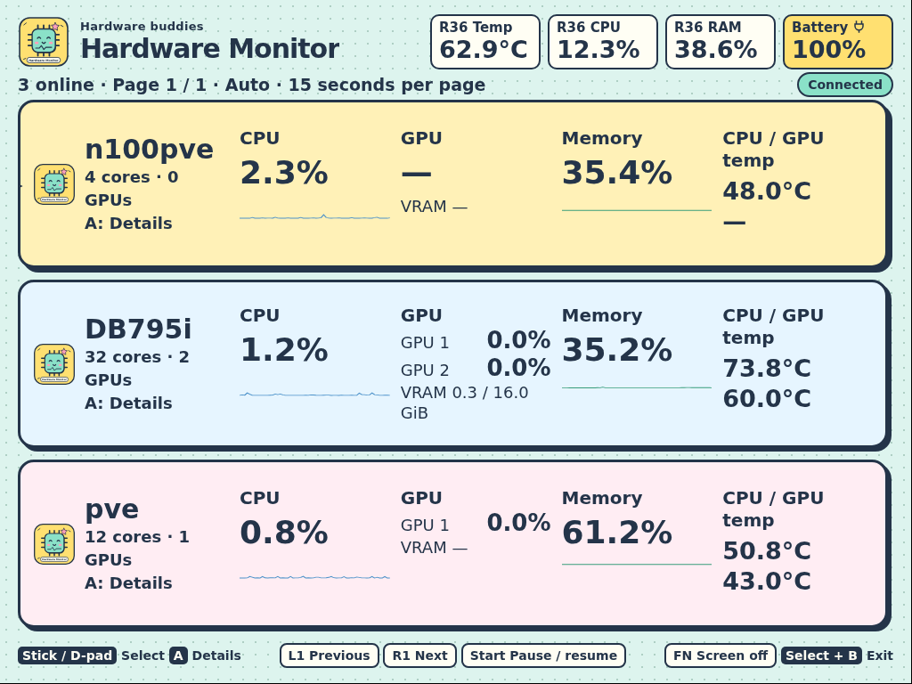
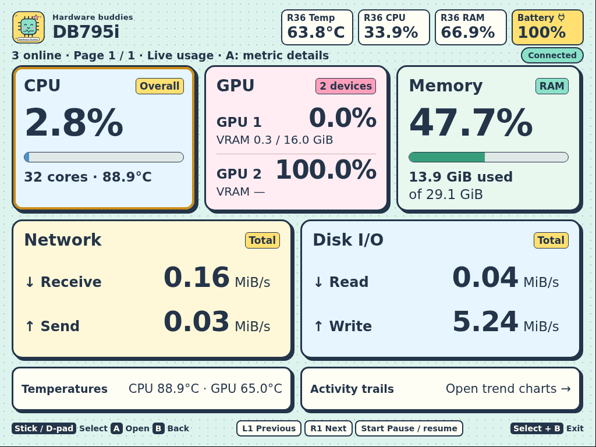
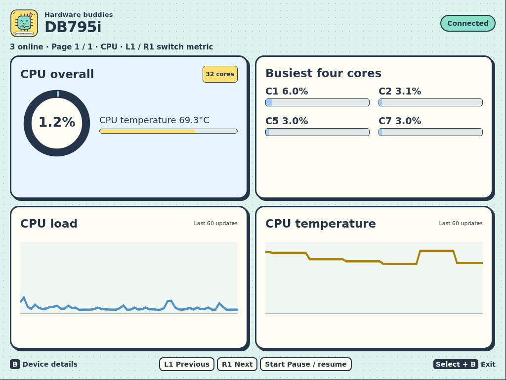
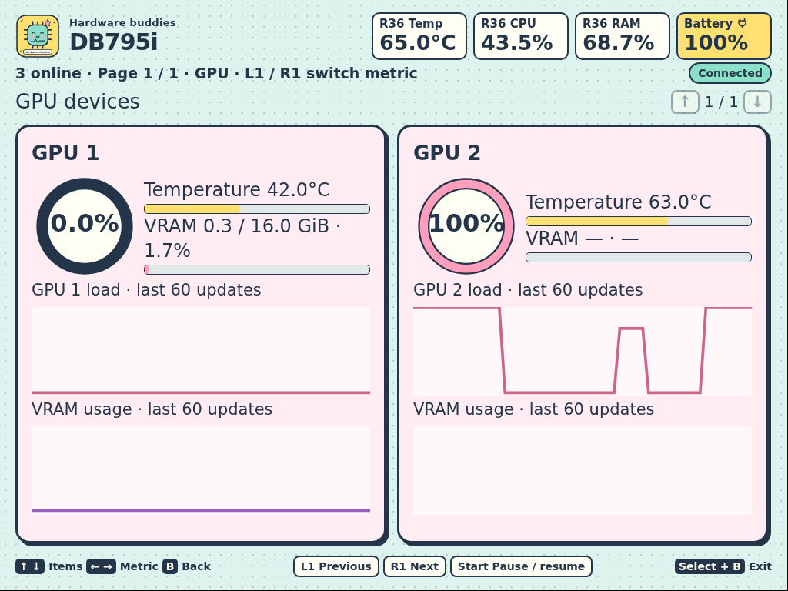
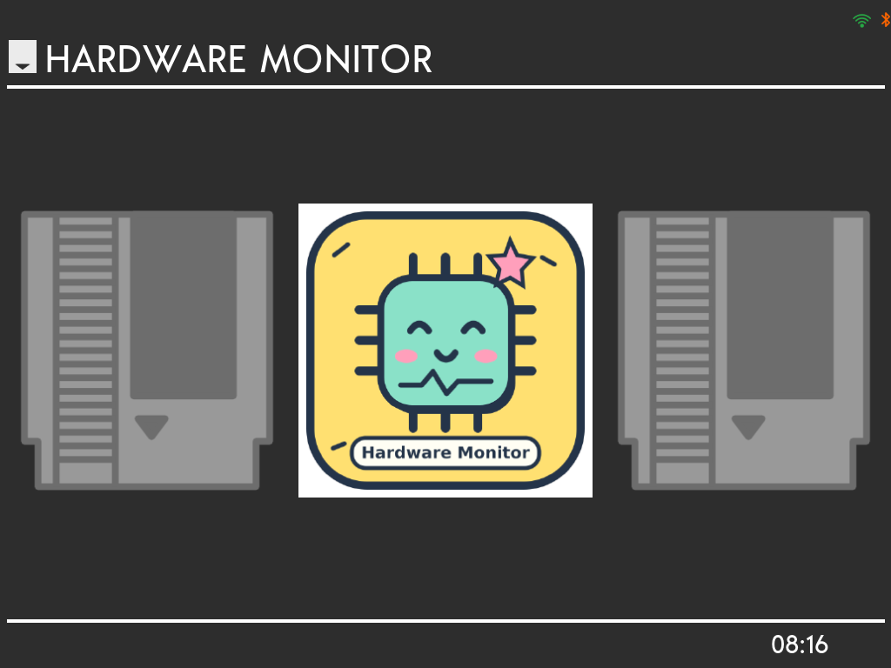

# R36 MAX 2 Hardware Monitor

**用一台低成本掌機，隨時查看多台電腦的硬體狀態。**

把 R36 MAX 2 變成桌上的獨立監控螢幕，透過 MQTT 顯示 CPU、GPU、VRAM、記憶體、網路、磁碟與溫度。保留原本的遊戲選單，從 **Ports → Hardware Monitor** 就能進入監控。

## 實機畫面

以下為 R36 MAX 2 上擷取的實際畫面，解析度為 1024 × 768。

### 三台電腦，一眼看懂

總覽每頁最多三台；更多電腦以分頁呈現。可以自動輪播，也能用按鍵選取一台查看詳細資訊。



### 單台詳細頁，大字查看主要指標

所有監控頁面的右上角都有固定的 R36 本機狀態列，顯示掌機 SoC 溫度、CPU 使用率、記憶體使用率和電池電量，每兩秒更新。這些讀值來自掌機本身，與 MQTT 電腦資料分開；充電中顯示閃電，充滿但仍接著電源時顯示插頭。無法取得的資料顯示 `—`。

單台主機的第一層詳細頁以約 50 公分的桌面觀看距離為設計目標：CPU、記憶體使用率採 64 px 大字，網路接收／傳送與磁碟讀取／寫入流量採 48 px 大字，同屏顯示，不需要上下捲動。GPU 有幾張就列出幾張使用率與 VRAM；字級依數量調整，兩張 GPU 時使用率為 44 px，更多 GPU 的完整資訊可進入 GPU 單項頁查看。

第一層保留簡單使用量條、VRAM 和記憶體容量，核心明細、裝置清單與趨勢圖放在單項詳細頁。溫度和趨勢圖可從底部入口開啟；實際可讀性仍取決於亮度與使用者視力。



### 低亮度與手動關閉螢幕

進入 Hardware Monitor 時，背光設為 16 / 255 的低亮度，保留非零背光。實際可讀性需要使用者在掌機上確認；不同面板可用 `R36_MONITOR_BRIGHTNESS` 環境變數調整，範圍限制為 1 到面板上限。

按機身 FN 功能鍵透過 DPMS 關閉顯示並關背光，再按同一鍵恢復顯示與低亮度畫面；頁面右下角也有 FN 按鈕。自動休眠計時為 0，只有手動按鍵才會關閉顯示。系統與 MQTT 接收繼續執行，其他導覽按鍵在黑屏時不切頁。正常退出監控或啟動腳本結束時恢復顯示與原本亮度。

在這台 R36 MAX 2 上，DPMS 關閉時 DRM 顯示狀態為 `Off`、背光電源狀態為 `4`，喚醒後恢復 `On` 與 `0`。這是驅動回報的顯示關閉狀態，未量測面板各供電電路或實際省電量。若 DPMS 關閉命令失敗，程式退回只關背光並在 `page.log` 記錄原因；喚醒失敗時保持休眠狀態，仍可再按 FN 重試。

監控程式執行期間接管遊戲手把輸入，避免系統的 FN 加方向鍵快捷鍵同時改變亮度。退出後系統快捷鍵恢復；獨立音量鍵和電源鍵保留系統功能。

### 點開 CPU 或 GPU，查看單項圖形資訊

在設備詳細頁用方向鍵選擇資訊卡，按 A 開啟單項詳細頁。也可以點擊卡片。CPU 顯示整體負載、最忙四核心與溫度趨勢；GPU 逐張顯示負載、VRAM 和趨勢圖。記憶體、網路、磁碟、溫度與活動趨勢同樣可以各自開啟。





單項頁仍採整屏版面，使用 L1／R1 切換資訊類別，按 B 返回設備詳細頁，再按 B 返回總覽。單項頁的標題、主要數值與圖表一併放大。GPU 每頁顯示兩張；網路、磁碟和溫度每頁顯示四個項目，上下方向鍵或類比搖桿切換項目頁，也可以按畫面上的箭頭。全部項目均可查看，網路與磁碟總量仍包含全部裝置。

### 遊戲選單裡的固定入口

笑臉晶片圖示讓監控入口容易辨認。退出監控後，回到原本的遊戲選單。



## 低成本的價值

需要的顯示設備就是一台 R36 MAX 2、系統 SD 卡和電源。如果手邊已經有掌機，就能沿用螢幕、實體按鍵與 Wi-Fi，把它放在桌邊查看電腦狀態。

採集程式在被監控電腦上執行，掌機負責接收與顯示。已有 MQTT broker 的使用者可以直接接上原本的資料流；這份專案不要求另建一套 broker。

漫畫風的晶片角色、色塊儀表和使用量條，讓資訊容易辨識。監控開啟期間不會自動休眠，可用 FN 手動關閉顯示，並從啟動時隱藏滑鼠游標，全程使用掌機按鍵操作。

## 按鍵操作

兩支類比搖桿皆可使用，具有中心死區，長推會連續移動。斜推依偏移較大的方向移動。

| 按鍵 | 操作 |
| --- | --- |
| 方向鍵／左右類比搖桿 | 上下選取電腦，左右翻頁；設備詳細頁依卡片位置四方向選取；單項頁左右切換類別、上下切換項目頁 |
| FN | 手動 DPMS 關閉顯示與背光；再按 FN 恢復低亮度畫面，MQTT 持續更新 |
| A | 進入設備詳細頁，再進入選定資訊卡的單項頁；輪播保持暫停 |
| B | 逐層返回，保持暫停 |
| L1／R1 | 前後翻頁；單項頁中切換資訊類別；輪播保持暫停 |
| Start | 在總覽暫停或恢復輪播 |
| Select + B | 退出監控，回到遊戲選單 |

自動輪播每 15 秒換頁。手動操作後，只有按 Start 才恢復輪播。主機 10 秒未傳來資料便移除；若正在查看該主機，畫面會回到總覽。趨勢圖保留最近 60 次資料更新。

## 資料串接

```text
被監控電腦上的 Agent → MQTT broker → R36 MAX 2 監控畫面
```

本專案相容 [hwmonitor-mqtt](https://github.com/jhihweijhan/hwmonitor-mqtt) 的資料格式，預設訂閱 `sys/agents/+/metrics`。每台電腦使用不同的 `host` 名稱，掌機就會自動建立對應項目。

先依 [hwmonitor-mqtt 的安裝說明](https://github.com/jhihweijhan/hwmonitor-mqtt#快速開始) 設定 Linux 或 Windows 採集端與 broker。掌機上的 Python 程式接收 MQTT，再把資料送給本機瀏覽器；broker 不需要支援 WebSocket。

## 安裝到掌機

目前交付的是**顯示端原始碼與啟動腳本**，不包含整合完成的刷機映像。以下步驟用於已安裝 dArkOS4Clone、可透過 SSH 登入的 R36 MAX 2，帳號為 `ark`。系統安装請參考 [(d)ArkOS4Clone](https://github.com/lcdyk0517/arkos4clone) 的 R36Max2 文件。

實機環境為 Debian 13 ARM64、Chromium、Xorg modesetting 與 Python 3。其他 R36 型號與原廠系統尚未驗證；遊戲選單路徑與按鍵代碼可能不同。

### 快速安裝（建議）

安裝腳本為 [browser/install.sh](browser/install.sh)。以下命令在掌機上以 `ark` 執行；`git clone` 需要已安裝 Git。從開發電腦操作時，先用 `ssh ark@192.168.5.127` 登入，其他掌機請改成自己的 IP。

```bash
# 寫入掌機：下載並安裝；先退出遊戲或監控程式。
git clone https://github.com/KarlSideProjects/r36max2-hwmonitor.git
cd r36max2-hwmonitor
sudo -v
bash browser/install.sh
```

腳本安裝 Chromium、Xorg 與 Python MQTT 依賴，將 Debian GBM 函式庫放在應用程式自己的 `lib` 目錄，保留遊戲系統的 Mali 函式庫。它啟用 `ark` 的 linger 和系統內建 ZRAM，安裝程式與圖示，再重新載入遊戲選單。常亮與隱藏游標由啟動腳本處理。已有相依套件時跳過套件安裝。

每次安裝先建立私有 `/home/ark/hwmonitor-backup.*` 備份，輸出完整路徑。備份包含 MQTT 帳密，不要上傳。已存在的 MQTT 設定會保留；提供 `--config FILE` 才會替換。重複執行會更新檔案，保留其他 Ports 項目與遊玩紀錄。

### MQTT 設定與更新

首次安裝若未提供設定，腳本會提示 `MQTT setup pending`。由操作者依 broker 資訊填寫設定檔，不要把帳密寫進 Git 或 AI 的公開輸出。

```bash
# 寫入掌機：準備本機設定。
install -m 600 browser/mqtt-config.example.json /home/ark/hwmonitor-mqtt.json
nano /home/ark/hwmonitor-mqtt.json
```

設定鍵為 `host`、`port`、`topic`、`username`、`password`、`tls`，格式見 [mqtt-config.example.json](browser/mqtt-config.example.json)。匿名 broker 的帳密留空；TLS broker 設 `tls: true` 與對應埠號。

```bash
# 寫入掌機：套用設定並安裝。
bash browser/install.sh --config /home/ark/hwmonitor-mqtt.json
```

更新既有安裝時，先退出監控（Select + B），在乾淨的專案 checkout 執行：

```bash
# 寫入掌機：更新原始碼並重新安裝，保留 MQTT 設定。
git pull --ff-only
bash browser/install.sh
```

### 給 AI 的安裝指令

可把以下文字交給下一個 AI；補上掌機 IP 及首次安裝的私有 MQTT 設定檔位置。

> 請在 R36 MAX 2 上安裝 KarlSideProjects/r36max2-hwmonitor。先讀 README 的安裝流程與 browser/install.sh。透過 SSH 以 ark 登入掌機，確認是 Debian 13 ARM64 的 dArkOS4Clone，並且有 /roms/ports、/dev/dri/card0、/dev/input/event2 與內建 zram-swap.service。使用既有乾淨 checkout，或下載專案；不要覆蓋未提交修改。退出正在執行的遊戲或監控。執行 sudo -v 後執行 bash browser/install.sh；首次需要 MQTT 設定時使用 --config 指向掌機上的私有 JSON 檔。已有設定就保留，不要輸出帳密。記錄備份路徑，執行 --check，從 Ports 開啟 Hardware Monitor，再檢查 /status 的連線和主機資料、圖示、按鍵、不自動休眠、FN 關閉與喚醒，以及退出回選單。若 SSH 或 MQTT 資訊不足，只詢問缺少的資訊。報告通過哪些檢查及未驗證項目；不要自行刷機或更改 broker／採集端。

### 驗證安裝

```bash
# 唯讀：檢查安裝檔、依賴、MQTT 格式、選單、輸入權限、linger、ZRAM。
bash browser/install.sh --check
```

此檢查不會證明 MQTT 已成功連線。操作者在掌機選取 **Ports → Hardware Monitor**，看到電腦後，再在 SSH 執行：

```bash
# 唯讀：只輸出連線狀態與在線主機數，不輸出設定帳密。
python3 - <<'PY_CHECK'
import json, urllib.request
s=json.load(urllib.request.urlopen('http://127.0.0.1:8766/status', timeout=5))
print('connection:', s['connection'], 'online:', s['count'])
assert s['connection'] == 'Connected' and s['count'] > 0
PY_CHECK
```

以方向鍵或類比搖桿選主機，A 開詳細頁，B 返回，Select + B 退出。畫面不會自動休眠且沒有滑鼠游標；按 FN 關閉顯示，再按 FN 恢復，確認 MQTT 保持連線。`Device Info` 入口可查看掌機資訊。

腳本已在目前掌機上測試既有安裝的更新與重複執行。全新系統的套件安裝與下列還原流程仍屬待實機驗證；首次執行者需記錄結果。

### 還原安裝

先退出監控與遊戲。將 `backup` 設成安裝輸出的確切備份目錄。下列流程會還原應用程式、選單檔案、圖示和 ZRAM 設定；apt 安裝的套件保留。

```bash
# 寫入掌機：還原；先填入安裝輸出的路徑。
backup='/home/ark/hwmonitor-backup.<安裝輸出代碼>'
set -e
test -f "$backup/files.tar.gz"
sudo tar -tzf "$backup/files.tar.gz" >/dev/null
sudo systemctl stop emulationstation
sudo rm -rf /home/ark/device-browser
sudo rm -f '/roms/ports/Hardware Monitor.sh' '/roms/ports/Device Info.sh' /roms/ports/images/hardware-buddy.png
sudo tar -C / -xzf "$backup/files.tar.gz"
if [ "$(cat "$backup/linger")" = no ]; then sudo loginctl disable-linger ark; fi
if [ "$(cat "$backup/zram-active")" != active ]; then sudo systemctl stop zram-swap.service; fi
if [ "$(cat "$backup/zram-enabled")" = disabled ]; then sudo systemctl disable zram-swap.service; fi
sudo systemctl start emulationstation
```

首次安裝前沒有 `gamelist.xml` 時，備份不含它；還原時需刪除新增的 Hardware Monitor XML 項目，保留安裝後新增的其他遊戲項目。還原期間不要執行其他選單編輯，否則備份會覆蓋那些修改。

### 入口退回選單或網頁報錯

先讀 `/home/ark/device-browser/launch.log`、`page.log`、`chromium.log`，不要輸出 MQTT 設定。`--check` 指出缺少檔案、linger 或 ZRAM 時重新執行安裝；原廠 OS、其他 CPU 架構或缺少內建 ZRAM 的映像會被拒絕，需先確認系統，勿繞過檢查。若直接從 SSH 執行啟動腳本出現 `drmSetMaster failed`，原因可能是遊戲選單仍占用顯示裝置；應從 Ports 入口啟動。連線未完成時檢查 broker 與採集端，HTTP 8766 只在監控入口開啟時提供服務。

## 驗證與限制

2026-10-07 已在 R36 MAX 2 上接收三台電腦的真實資料，驗證總覽、詳細頁、按鍵操作、常亮及退出後回到遊戲選單。程式測試涵蓋七台主機分頁；版面測試涵蓋零、兩、四張 GPU，以及 1024 × 768 下沒有捲動或裁切。

GPU、VRAM 與溫度等資訊取決於採集端回報內容。缺少資料時以橫線標示，不以零值代替。更多主機的實機顯示，以及其他掌機型號，仍需各自驗證。

在開發電腦執行基本測試，Python 測試不需要連接 MQTT broker：

```bash
python3 browser/test_monitor.py
python3 browser/test_monitor_events.py
python3 browser/test_menu.py
python3 browser/test_device_info.py
node browser/test_monitor_ui.cjs
bash -n browser/install.sh browser/client.sh browser/xserver.sh 'browser/Hardware Monitor.sh'
```

版面測試需要 Node.js 與 Playwright，可執行 `node browser/test_monitor_layout.cjs`。在已開啟監控的掌機上，`measure_startup.py`、`measure_input.py` 與 `test_awake.py` 分別检查啟動等待、按鍵到畫面的延遲，以及常亮設定。

## 授權與相關專案

程式碼採用 [GNU GPL v3](LICENSE)。本專案連接 [hwmonitor-mqtt](https://github.com/jhihweijhan/hwmonitor-mqtt) 的監控資料，掌機系統來自 [(d)ArkOS4Clone](https://github.com/lcdyk0517/arkos4clone)。

漫畫晶片圖示與監控頁面原始碼位於 [browser/assets](browser/assets) 與 [browser/monitor.html](browser/monitor.html)。Ports 截圖中的 EmulationStation 介面使用 [es-theme-switch](https://github.com/Jetup13/es-theme-switch)，其第三方元件依原專案授權；本儲存庫不包含完整遊戲系統或其二進位套件。
